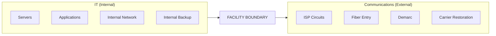

# IT vs Communications Boundary — Authoritative Doctrine

**Status:** Authoritative  
**Applies to:** Question authors, reviewers, lint rules, future modules  
**Violation:** Questions that violate this boundary are invalid by definition.

---

## SECTION 1 — PURPOSE

### Why IT and Communications Are Separate Dependencies

Information Technology (IT) and Communications (CO) represent distinct operational domains with different failure modes, restoration pathways, and ownership. Merging them degrades assessment quality:

1. **Different failure modes** — IT fails when servers, applications, or identity systems fail. Communications fails when carrier circuits, fiber, or transport are cut. A facility can have working IT but no external connectivity, or external connectivity but broken internal systems.

2. **Different restoration pathways** — IT restoration is typically internal (sysadmins, cloud recovery, backup restoration). Communications restoration is typically external (carrier dispatch, ISP repair, fiber splice).

3. **Different ownership boundaries** — IT assets are usually owned or controlled by the facility (or its managed services provider). Communications assets beyond the demarc are owned by the carrier.

4. **Different vulnerability logic** — Single-point-of-failure for IT (IT-3) means internal network redundancy. Single-point-of-failure for Communications (CO-3) means carrier circuit redundancy. These are not interchangeable.

### Why Crossover Degrades Determinism and Assessor Clarity

- **Ambiguous questions** — "Does the facility have redundant connections?" could mean internal LAN paths (IT) or external carrier circuits (CO). Assessors answer differently without a clear boundary.

- **Duplicate vulnerability triggers** — Vehicle impact (IT-7, CO-7) assesses the same physical risk but for different component sets. If questions drift, the same asset could be counted twice or not at all.

- **Report inconsistencies** — Findings must map to specific dependencies. Blurred boundaries produce vague narratives ("communications or IT") instead of actionable ones.

---

## SECTION 2 — DEFINITIVE SCOPE TABLE

| Domain | Includes | Explicitly Excludes |
|--------|----------|---------------------|
| **IT** | Internal digital systems, internal networks, servers, applications, identity systems, internal hardware protection, internal backups, cloud services, managed IT providers, internal routing/switching, data center assets, backup generators for IT load | Carrier circuits, ISP fiber, last-mile, demarc equipment, provider routing, wireless carriers, microwave links, antenna/satellite equipment at facility boundary |
| **Communications** | External carrier-based transport, ISP circuits, fiber, wireless, microwave, demarc points, carrier restoration, last-mile connectivity, upstream carrier assets (towers, nodes, cell sites) | Internal servers, applications, LAN/WAN, identity systems, internal switches/routers, internal backup systems |

### Examples from the Existing Question Set

| Question ID | Domain | Scope Clarification |
|-------------|--------|---------------------|
| `curve_requires_service` (IT) | IT | "internal digital systems (applications, servers, cloud services, identity systems)" — explicitly internal |
| `curve_requires_service` (CO) | CO | "communications service" — carrier-based transport |
| IT-1 | IT | "IT service provider(s)" — managed IT, cloud provider, internal IT |
| CO-1 | CO | "communications service provider(s)" — ISP, telecom carrier |
| IT-2 | IT | "upstream IT assets or critical systems" — servers, data centers, critical internal systems |
| CO-2 | CO | "upstream communications assets" — carrier towers, fiber nodes, cell sites |
| IT-3 | IT | "IT service connections or redundant network paths" — internal network redundancy |
| CO-3 | CO | "communications service connections" — carrier circuits (fiber, wireless, etc.) |
| IT-6 | IT | "IT infrastructure components" — servers, switches, racks; protection from physical damage |
| CO-6 | CO | "exterior communications components" — demarc, antenna, connection points at facility boundary |
| IT-7 | IT | "IT infrastructure components" exposed to vehicle impact — internal components in vulnerable locations |
| CO-7 | CO | "exterior communications components" exposed to vehicle impact — demarc, antenna, entry points |
| IT-8 | IT | "backup IT capability" — internal backup systems, cloud failover |
| CO-8 | CO | "backup communications capability" — satellite, alternate carrier circuit, wireless backup |
| IT-11 | IT | "coordination with the IT service provider" — managed IT, cloud provider |
| CO-11 | CO | "coordination with the service provider" — carrier for restoration |

---

## SECTION 3 — DECISION TEST (NON-NEGOTIABLE)

> **If a question can be answered without referencing an external carrier, it does not belong in Communications.**

> **If a question involves carrier transport beyond the facility boundary, it does not belong in IT.**

### Application

| Scenario | Domain |
|----------|--------|
| "Can the facility identify its ISP?" | CO — carrier |
| "Can the facility identify its IT service provider?" | IT — may be internal or managed |
| "Are multiple fiber circuits from different carriers present?" | CO — carrier transport |
| "Are internal network paths redundant?" | IT — internal |
| "Is the demarc protected from vehicle impact?" | CO — demarc is carrier boundary |
| "Are server racks protected from physical damage?" | IT — internal infrastructure |
| "Does backup include satellite or alternate carrier?" | CO — carrier backup |
| "Does backup include cloud failover or internal UPS?" | IT — internal backup |

---

## SECTION 4 — COMMON FAILURE MODES

### 1. Vehicle Impact Logic Duplicated in IT and CO

**Issue:** IT-7 and CO-7 both assess vehicle impact exposure. Historically, the same physical asset (e.g., a demarc cabinet) could be interpreted as either IT or CO.

**Doctrine:** 
- **IT-7** — Components *inside* the facility boundary that are IT infrastructure (servers, switches, cabling) and exposed to vehicle impact (e.g., data center near loading dock).
- **CO-7** — Components at or *outside* the facility boundary that are carrier/communications (demarc, antenna, fiber entry point, connection cabinet).

**Rule:** If the component is carrier-owned or at the demarc, it belongs to CO. If it is facility-owned and internal, it belongs to IT.

### 2. Physical Protection Questions Drifting Across Tabs

**Issue:** "Are components protected?" (IT-6, CO-6) can drift — IT-6 uses "IT infrastructure components" (no "exterior"); CO-6 explicitly uses "exterior communications components."

**Doctrine:** 
- **IT-6** — Internal IT components (racks, switches, servers) protected from accidental/intentional damage.
- **CO-6** — Exterior communications components (demarc, antenna) protected from accidental/intentional damage.

**Rule:** CO-6 must remain explicitly "exterior." IT-6 remains "IT infrastructure components" (which may include exterior cabling/conduits that are facility-owned and internal to the IT path).

### 3. Redundancy Questions Losing INTERNAL vs EXTERNAL Distinction

**Issue:** IT-3 ("multiple IT service connections or redundant network paths") and CO-3 ("multiple communications service connections") sound similar.

**Doctrine:** 
- **IT-3** — Internal redundancy: multiple network paths, diverse routing *within* the facility or to the same/different internal/cloud providers.
- **CO-3** — External redundancy: multiple carrier circuits (different ISPs, different fiber paths, wireless + wired).

**Rule:** IT-3 = "Can the facility sustain operations if one internal path fails?" CO-3 = "Can the facility sustain operations if one carrier circuit fails?"

---

## SECTION 5 — MERMAID DIAGRAM



### Tree View (Conceptual)

```
[ Facility Boundary ]
  ├── IT (Internal)
  │     ├── Servers
  │     ├── Applications
  │     ├── Internal Network
  │     ├── Internal Backup
  │
  └── Communications (External)
        ├── ISP Circuits
        ├── Fiber Entry
        ├── Demarc
        ├── Carrier Restoration
```

### Diagram Legend

| Zone | Ownership | Examples |
|------|-----------|----------|
| **IT (Internal)** | Facility or managed services | Servers, applications, internal network, internal backup, identity systems |
| **Communications (External)** | Carrier | ISP circuits, fiber entry, demarc, carrier restoration |
| **Facility Boundary** | Demarc | Point where carrier responsibility ends and facility responsibility begins |

### No Overlap Region

There is no overlap. A given asset belongs to either IT or Communications, determined by the decision test:

- **Inside facility boundary, no carrier reference** → IT  
- **Carrier transport or at/beyond demarc** → Communications  

---

## Revision History

| Date | Change |
|------|--------|
| 2026-02-11 | Initial authoritative doctrine |
